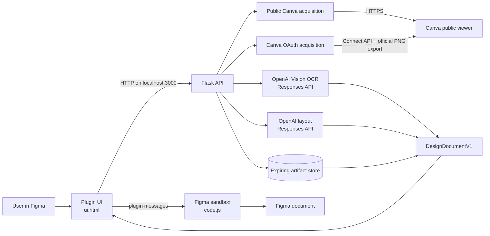
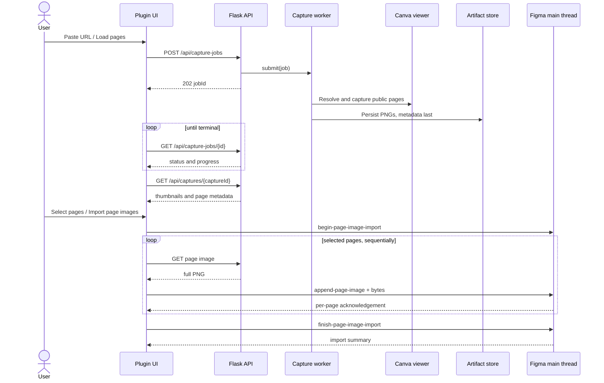
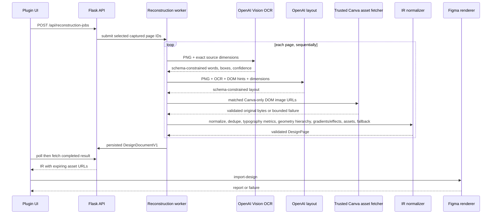
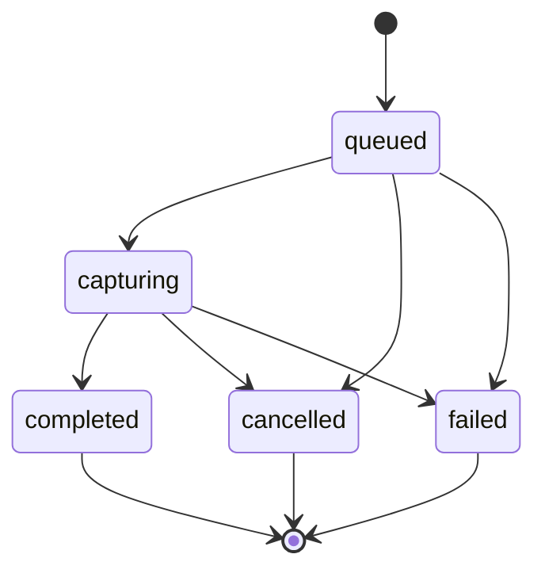

# System Architecture

## 1. System context

The repository is a local two-process application:



The browser and model providers never create Figma nodes. The browser produces captured pages; providers produce evidence; deterministic Python produces a validated Design IR; the Figma main thread alone mutates the Figma document.

## 2. Runtime processes

### Flask process

`run.py` disables Flask's implicit dotenv handling, creates the app, and starts Flask threaded with no reloader. `Settings.load()` explicitly loads the repository `.env`, validates every supported setting, and restricts binding to loopback.

`create_app()` constructs one `ServiceContainer`:

- `ArtifactStore` for expiring captures, jobs, and binary assets.
- `PublicCanvaAcquisitionProvider` and `CaptureCoordinator`.
- `CanvaOAuthManager`, `CanvaConnectClient`, and `CanvaOAuthAcquisitionProvider` for the optional local OAuth trial.
- `CaptureJobRunner` with a bounded thread pool.
- `OpenAIVisionOcrProvider` and `OpenAILayoutProvider`.
- `asset_fetch.py`: Canva-only original-image download, redirect/content/signature/decode validation, and modern-format normalization.
- `ReconstructionJobRunner` with a maximum of two workers.

Outside tests, an artifact cleanup thread starts with the app. Shutdown is idempotent: cleanup stops, cancellation signals are set, and executors reject pending futures.

### Figma plugin process

Figma separates plugin code into:

- `ui.html`: browser-like UI context. It can call the local HTTP API, display previews, poll jobs, and transfer image bytes.
- `code.js`: privileged Figma sandbox. It can create, remove, select, and annotate Figma nodes but does not call the Flask API directly.

They communicate through `parent.postMessage` and `figma.ui.postMessage`. The split is mandatory; Python cannot replace `code.js`.

## 3. Exact page-image flow



Sequential transfer bounds plugin memory and gives a transaction boundary. The main thread tracks created frames by session. Cancellation or any fatal session error removes all frames created by that session.

## 4. Authenticated Canva export flow

OAuth uses authorization-code PKCE and a backend-only client secret. The plugin receives only the Canva authorization URL and polls connection state; access and refresh tokens remain in Flask memory. Official per-page PNGs are normalized into the same capture contract used by public browser capture. Both providers share the bounded `CaptureJobRunner`.

## 5. Editable reconstruction flow



Provider failures are isolated per page. `reconstruct_document()` creates a full-page raster fallback when a page cannot be reconstructed, allowing the job to complete with warnings instead of losing visible content.

## 6. Capture job state machine



Capture progress is inferred from structured progress messages emitted by acquisition. Work is rejected with `CAPTURE_BUSY` when all capture worker slots are active; the executor is not an unbounded user-visible queue.

## 7. Reconstruction job state machine

The model permits `queued`, `capturing`, `analyzing`, `rendering`, `completed`, `failed`, and `cancelled` for API compatibility. The current Python runner actually transitions `queued → analyzing → completed|failed|cancelled`; Figma rendering occurs after the backend job and is tracked in the UI, not persisted as a backend `rendering` transition.

Reconstruction processes selected pages sequentially inside a job. Up to two jobs can run concurrently. Cancellation is cooperative and is checked between provider/page operations; an in-flight network call may take up to its provider timeout before cancellation is observed.

## 8. Artifact lifecycle

```text
.jobs/
├── captures/
│   └── <capture-id>/
│       ├── metadata.json
│       └── <page-id>.png
├── capture-jobs/
│   └── <job-id>.json
├── jobs/
│   └── <job-id>.json
└── job-assets/
    └── <job-id>/
        └── <sha256(asset-id)>.<ext>
```

Important properties:

- UUIDs are validated before filesystem lookup.
- Artifact filenames are generated from server IDs, not user paths.
- JSON writes use a temporary file and atomic replacement.
- Capture metadata is written after all page files, so interrupted directories are not treated as complete.
- Embedded reconstruction assets are split out before job JSON is persisted and restored only when the internal model is loaded.
- HTTP responses substitute completed-job embedded data with expiring localhost asset URLs.
- Capture expiry uses `expiresAt`; job expiry uses the last `updatedAt`.
- Cleanup runs periodically and is also invoked on store access.

This is local persistence, not durable job infrastructure. Running jobs are not resumed after a process crash or restart. Persisted nonterminal job records can remain nonterminal until TTL cleanup.

## 9. Dependency directions

```text
routes -> services -> runners -> acquisition/providers/reconstruction -> models
                    \-> store -------------------------------> models

ui.html -> HTTP API
ui.html -> code.js message contract
code.js -> Figma Plugin API
```

`models.py` is the contract center. Acquisition does not import Flask. Reconstruction depends on provider protocols, which allows deterministic isolated provider tests without changing production provider selection.

## 10. Trust boundaries

| Boundary | Control |
| --- | --- |
| User URL → backend | strict HTTPS Canva host/path validation, length limits, no userinfo/custom ports/control characters |
| OAuth callback → backend | PKCE/SHA-256, one-time expiring state, exact configured redirect, backend client authentication |
| Canva tokens → runtime | backend-only and memory-only; serialized refresh rotation; disconnect/restart removal |
| Export URL → page bytes | HTTPS Canva host validation on every redirect, MIME/decode/dimension/byte limits |
| Short link → final URL | bounded manual redirects, trusted-host validation on every hop, loop detection |
| Canva page → capture | fixed-page candidate scoring, access classification, dimensions and byte limits |
| Model response → IR | JSON parsing, small Pydantic schema, deterministic normalization, full IR validation |
| SVG → Figma | well-formed XML check; active/external content and external paint references rejected |
| Backend → plugin | localhost manifest allowlist, structured JSON, bounded response size |
| Plugin → Figma document | metadata validation, sequential transactions, rollback, warning layers |
| Disk artifacts | server-generated IDs, expiring local directories, binary payloads kept out of normal JSON |

See [Security](SECURITY.md) for residual risks.

## 11. Scaling and replacement seams

Safe seams already exist:

- Add or replace acquisition providers without changing Design IR; public URL and Canva OAuth providers are both active.
- Implement another `OcrProvider` or `LayoutProvider`.
- Move binary artifacts to object storage behind `ArtifactStore`.
- Move jobs to a durable queue while keeping HTTP shapes stable.
- Add Design IR V2 while retaining the V1 renderer.

A hosted product still needs authentication, tenant isolation, durable jobs, object storage, quotas, rate limiting, observability, privacy/retention controls, and a production Figma manifest. The current Flask development server and unauthenticated localhost API are not that deployment.
